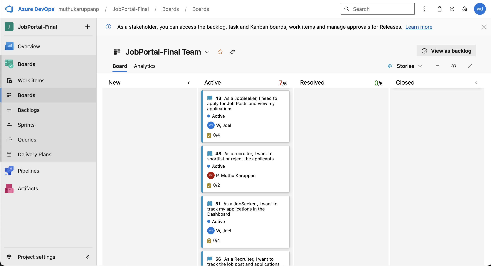
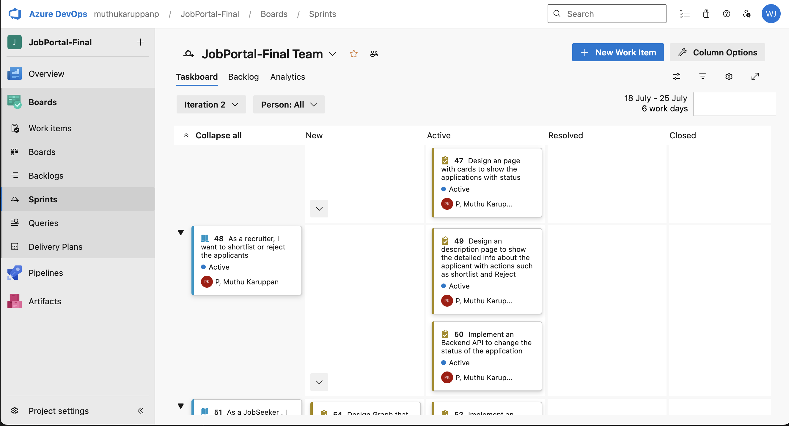

# JobPortal API - Azure DevOps Agile Project

This repository contains the Agile planning artifacts and UML diagrams for the **JobPortal API** project, managed using **Azure DevOps**. The project follows Agile methodology and includes work item planning, sprint management, and system design documentation.

## The Azure Projects Dashboard 

Here, The Images of all the Work-items, Backlogs and the Sprints attached below.

## WorkItems

## Backlogs

## Boards

## Sprints

## Class Diagram

## Sequence Diagram

